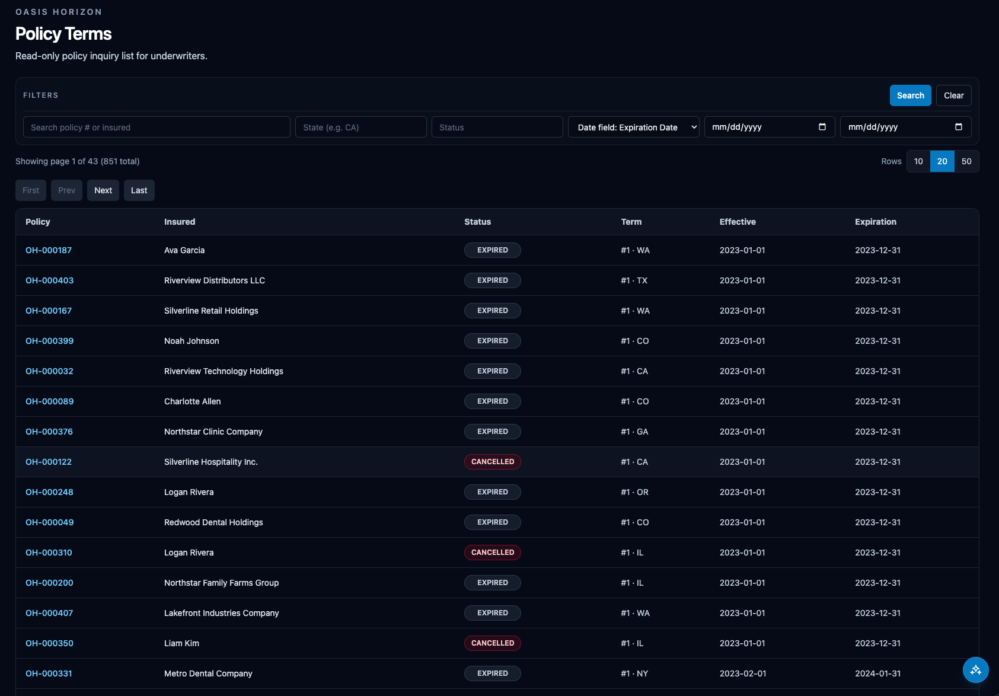
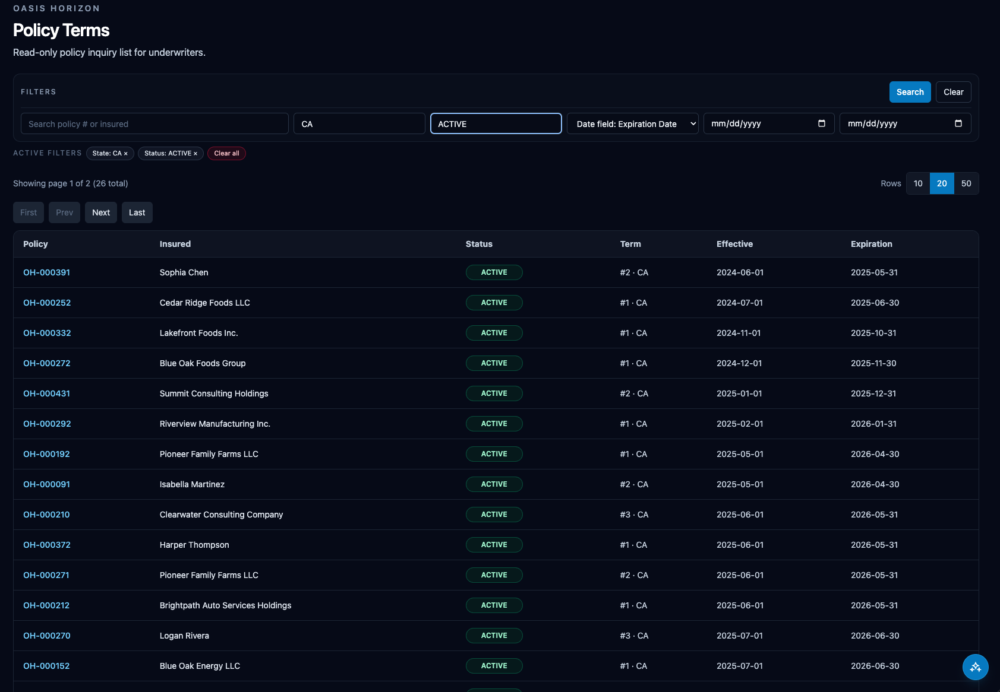
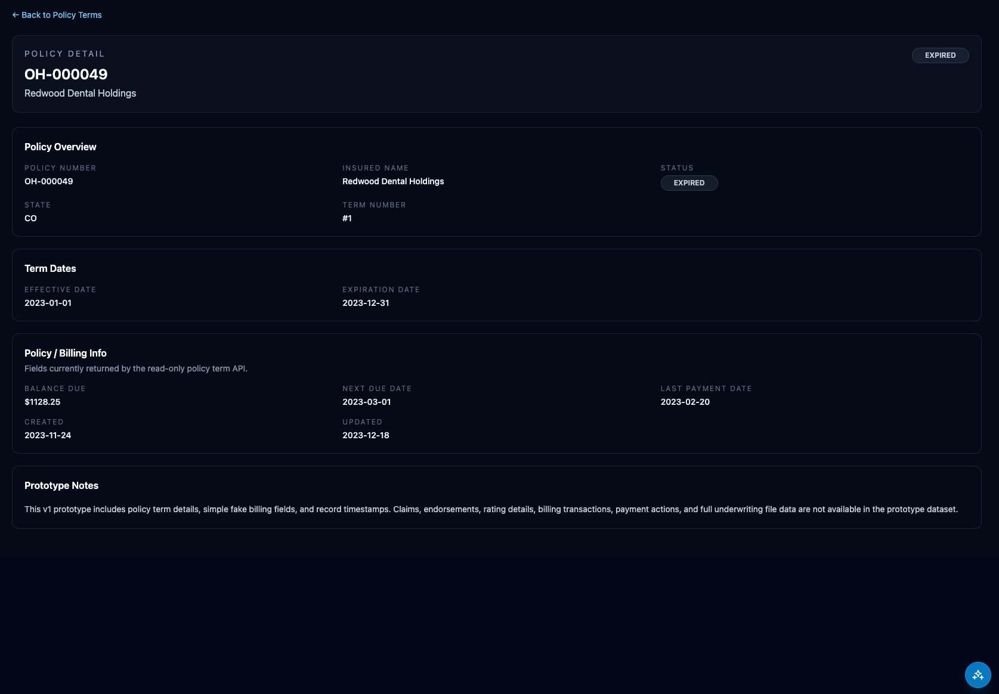
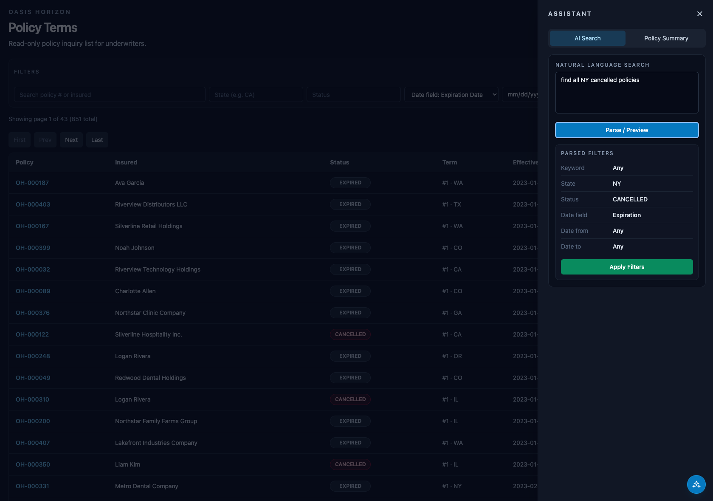
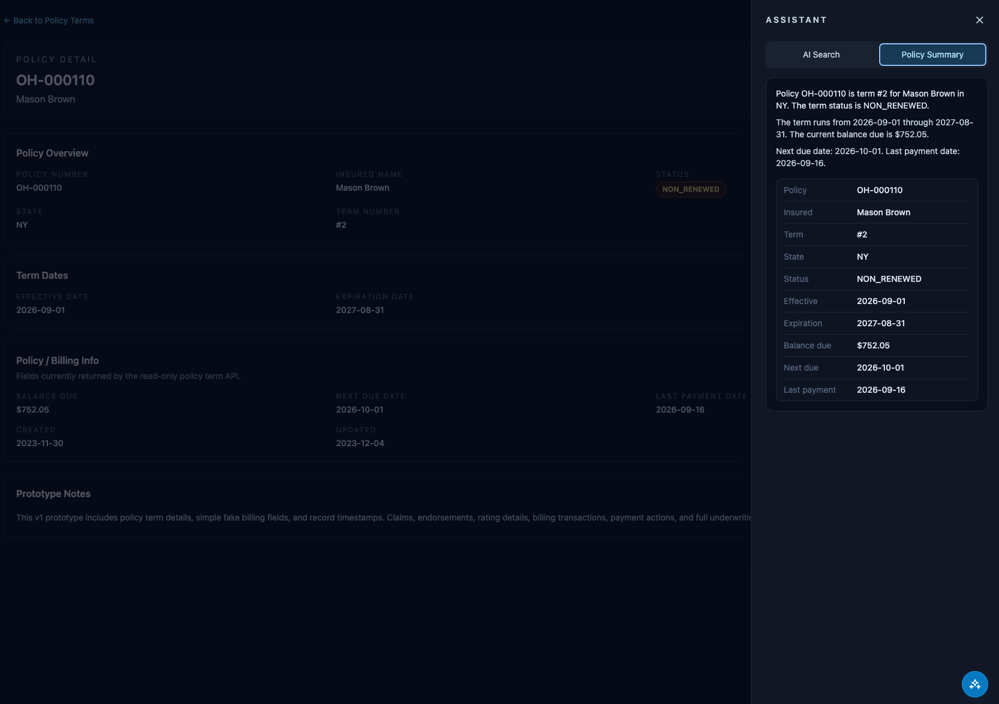

# Oasis Horizon

Oasis Horizon is an early-stage open-source prototype for modernizing legacy insurance policy inquiry workflows.

The project focuses on a read-only Policy Inquiry/Search experience for underwriters. It demonstrates how a legacy insurance system module could be rebuilt with a modern web UI, API layer, relational database, reproducible sample data, and carefully scoped AI assistance.

Oasis Horizon is not a production system. It is a learning and demonstration project built with synthetic/sample data only.

## Problem

Many insurance organizations still depend on legacy systems for policy lookup, term inquiry, risk review, coverage inspection, and workflow support. These systems often contain valuable business workflows, but the user experience, data access patterns, and developer experience can be difficult to maintain or extend.

Oasis Horizon explores a practical modernization path:

- Preserve the shape of familiar insurance inquiry workflows.
- Rebuild the experience with a modern, maintainable stack.
- Keep the first version read-only and low risk.
- Use synthetic data instead of proprietary records.
- Add AI only where it can explain, summarize, or propose filters without taking write actions.

## Current Status

Oasis Horizon is an early-stage prototype. The current implementation centers on Policy Term Inquiry/Search and a Policy Term Detail view. It is intended for exploration, portfolio review, and open-source collaboration, not real insurance operations.

## Tech Stack

- Frontend: Next.js, TypeScript, Tailwind CSS, shadcn/ui
- Backend: Java, Spring Boot, REST APIs
- Database: PostgreSQL with Flyway migrations
- Local tooling: Docker Compose, Maven, npm helper scripts
- AI pattern: read-only assistant drawer for filter interpretation and grounded summaries

See [TECH_STACK.md](TECH_STACK.md) for the project-level stack notes.

## Current Functionality

- Policy Terms list with server-side filtering and pagination
- Policy Term Detail page
- Status, state, date, and keyword-style search flows
- Deterministic seeded data for local development
- Assistant drawer for:
  - Natural-language search interpreted into structured filters
  - Policy summary based on available policy and billing-like sample fields
- Read-only API endpoints for policy term inquiry
- Basic backend tests for assistant parsing behavior

## Synthetic Data

All policy data in this repository is synthetic/sample data generated for the prototype. It is not customer data, production data, employer data, or proprietary insurance content.

The project should stay that way. Contributions must not include:

- Proprietary company code
- Customer or policyholder data
- Confidential business logic
- Employer-specific internal workflows
- Real credentials, tokens, or secrets

## Demo Preview

Policy Terms search/list page:



Filtered list workflow:



Policy Term detail page:



Assistant drawer search:



Assistant drawer policy summary:



## Repository Structure

```text
/web      Next.js frontend
/api      Spring Boot backend
/docs     Supporting images and documentation assets
/scripts  Local startup helpers
```

## Local Setup

### Prerequisites

- Node.js 20 or compatible recent LTS
- npm
- Java 17
- Maven
- Docker Desktop or Docker Engine

### Start Everything Locally

From the repository root:

```bash
./scripts/start-postgres.sh
./scripts/start-api.sh
./scripts/start-web.sh
```

Useful local URLs:

- Web: `http://localhost:3000/policy-terms`
- API: `http://localhost:8080/api/policy-terms?size=10`

You can also run the helper that starts Postgres and prints the next commands:

```bash
./scripts/start-local.sh
```

### Manual Startup

Start Postgres:

```bash
docker compose up -d
```

Run the API with the local profile:

```bash
cd api
mvn spring-boot:run -Dspring-boot.run.profiles=local
```

Run the web app:

```bash
cd web
npm install
npm run dev
```

### API Smoke Checks

```bash
curl "http://localhost:8080/api/policy-terms?size=10"
curl "http://localhost:8080/api/policy-terms?state=CA&status=CANCELLED"
curl "http://localhost:8080/api/policy-terms?date_field=effective&date_from=2025-01-01&date_to=2025-12-31"
curl "http://localhost:8080/api/policy-terms/{termId}"
```

## Roadmap Summary

The roadmap is organized around incremental read-only modernization milestones:

1. Policy Term Inquiry/Search
2. Policy Detail View
3. Risk Inquiry
4. Coverage Inquiry
5. Workflow/Performance Observability
6. AI Assistant for developer support and legacy-system explanation

See [ROADMAP.md](ROADMAP.md) for details.

## Contributing

Contributions are welcome, especially small improvements to documentation, tests, UI polish, API validation, seed data clarity, and developer experience.

Because this project is intentionally early-stage, good issues are likely to be narrow and practical. Please keep pull requests reviewable and avoid introducing new technologies without discussion.

See [CONTRIBUTING.md](CONTRIBUTING.md) for setup, coding expectations, and contribution guidelines.

## Security and Privacy

This repository must remain free of proprietary code, customer data, confidential business logic, and secrets.

If you discover a possible privacy or security issue, please open a GitHub issue with a minimal description that does not disclose sensitive details. If the concern involves a secret or private data, do not paste it into the issue.

## License

This project is licensed under the MIT License. See [LICENSE](LICENSE).
